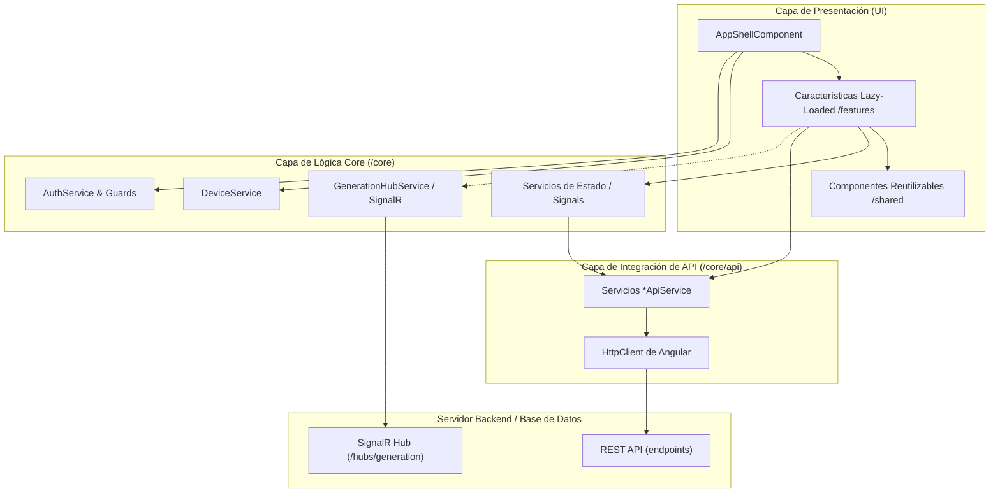

# Guía de Arquitectura — Lectivo (Generador de Horarios)

Esta documentación describe en detalle la arquitectura del frontend de la aplicación **Lectivo**, un sistema avanzado para la gestión y generación automatizada de horarios escolares en centros educativos.

---

## 1. Stack Tecnológico Principal

La aplicación está diseñada bajo estándares modernos de desarrollo web, priorizando la reactividad y el rendimiento óptimo del navegador:

- **Framework:** **Angular 21**
- **Detección de Cambios:** **Zoneless** (`provideZonelessChangeDetection`), que elimina la necesidad de `zone.js`, reduciendo el tamaño del bundle y aumentando el rendimiento de renderizado.
- **Arquitectura de Componentes:** **Standalone Components** en su totalidad, prescindiendo del uso de módulos tradicionales (`NgModule`).
- **Estrategia de Renderizado:** `ChangeDetectionStrategy.OnPush` configurada en todos los componentes para optimizar los ciclos de verificación de cambios.
- **Reactividad:** **Angular Signals** para la gestión reactiva del estado mutable e inmutable de la aplicación.
- **Comunicación en Tiempo Real:** **SignalR** (`@microsoft/signalr`) para la conexión bidireccional permanente con el motor de generación en el backend.
- **Compilador/Build:** **esbuild** con configuración en `angular.json` para compilaciones ultrarrápidas.
- **Estilos y Temas:** **Lectivo Design System** basado en tokens globales en OKLCH (`styles.scss`) e integrado con **PrimeNG Aura** en modo claro y oscuro (`.lectivo-dark`).

---

## 2. Diagrama de Capas de la Arquitectura

El siguiente diagrama ilustra cómo interactúan las diferentes capas de la aplicación, desde la interfaz de usuario externa hasta la API del servidor:



---

## 3. Estructura del Proyecto (`src/app/`)

La base de código está estructurada de forma modular, separando la lógica transversal del negocio y los componentes específicos de la interfaz:

```text
src/app/
├── core/             # Servicios globales singleton, gestión de estado y llamadas a API
│   ├── api/          # Un servicio API por cada recurso (Schools, Teachers, etc.)
│   ├── auth/         # Autenticación, interceptores HTTP y guardias de seguridad
│   ├── realtime/     # Conexión SignalR con el hub de generación
│   └── models.ts     # Definiciones de modelos y tipos TypeScript del dominio
├── shared/           # Componentes comunes e independientes de dominio
│   ├── schedule-grid/ # Componentes para renderizar la rejilla visual de horarios
│   └── ui/           # Botones, switchers, iconos y componentes visuales generales
├── shell/            # Layout general con menús de navegación móvil y escritorio
└── features/         # Vistas/Pantallas principales de carga diferida (lazy-loaded)
```

---

## 4. Detalle de Pantallas y Recursos Utilizados

A continuación, se detalla qué servicios, APIs, componentes reutilizables y lógica implementa cada una de las pantallas de la aplicación.

---

### A. Pantalla de Acceso (Login)

- **Ruta:** `/login` (Pública)
- **Componente:** [LoginComponent](file:///d:/Proyectos/Horarios/GeneradorHorarios-spa/src/app/features/login/login.component.ts)
- **Descripción:** Permite al usuario identificarse en el sistema. Proporciona control de credenciales y redirige según el rol (Administrador/Jefe de Estudios o Docente).
- **Recursos Utilizados:**
  - **Lógica Core/Servicios:**
    - [AuthService](file:///d:/Proyectos/Horarios/GeneradorHorarios-spa/src/app/core/auth/auth.service.ts): Gestiona la sesión del usuario actual, el token JWT y proporciona Signals de estado de login.
  - **Componentes Reutilizables:**
    - [LogoMarkComponent](file:///d:/Proyectos/Horarios/GeneradorHorarios-spa/src/app/shared/ui/logo-mark.component.ts): Renderiza el logotipo de la marca.
  - **Estilos:** Formulario estilizado con variables de entrada del Lectivo Design System.

---

### B. App Shell (Layout Autenticado)

- **Ruta:** Envolvente de todas las rutas autenticadas.
- **Componente:** [AppShellComponent](file:///d:/Proyectos/Horarios/GeneradorHorarios-spa/src/app/shell/app-shell.component.ts)
- **Descripción:** Proporciona la estructura del portal con barras de navegación diferenciadas por dispositivo (Sidebar en escritorio, barra inferior en móvil) y por rol (Admin o Profesor). Administra el modo oscuro a nivel global.
- **Recursos Utilizados:**
  - **Lógica Core/Servicios:**
    - [AuthService](file:///d:/Proyectos/Horarios/GeneradorHorarios-spa/src/app/core/auth/auth.service.ts): Comprueba roles y expone la información del centro educativo.
    - [DeviceService](file:///d:/Proyectos/Horarios/GeneradorHorarios-spa/src/app/core/device.service.ts): Detecta de forma reactiva si el dispositivo del usuario es un móvil para adaptar el layout.
    - [PeriodStateService](file:///d:/Proyectos/Horarios/GeneradorHorarios-spa/src/app/core/period-state.service.ts): Expone el periodo del curso seleccionado de forma global.
    - [BlockStateService](file:///d:/Proyectos/Horarios/GeneradorHorarios-spa/src/app/core/block-state.service.ts): Expone la etapa educativa (bloque) seleccionada de forma global.
  - **Componentes Reutilizables:**
    - [LogoMarkComponent](file:///d:/Proyectos/Horarios/GeneradorHorarios-spa/src/app/shared/ui/logo-mark.component.ts)
    - [PeriodSelectorComponent](file:///d:/Proyectos/Horarios/GeneradorHorarios-spa/src/app/shared/ui/period-selector.component.ts): Selector de jornada activa en la barra superior (Jornada completa vs. reducida).
    - [BloqueSwitcherComponent](file:///d:/Proyectos/Horarios/GeneradorHorarios-spa/src/app/shared/ui/bloque-switcher.component.ts): Permite al administrador filtrar la etapa educativa de manera global.
  - **Funcionalidades Especiales:**
    - Control de Tema: Guarda la preferencia de tema oscuro en `localStorage` y aplica/retira la clase `.lectivo-dark` sobre el elemento `<html>`.

---

### C. Panel del Administrador (Dashboard)

- **Ruta:** `/dashboard` (Requiere rol de Administrador)
- **Componente:** [DashboardComponent](file:///d:/Proyectos/Horarios/GeneradorHorarios-spa/src/app/features/dashboard/dashboard.component.ts)
- **Descripción:** Vista principal del director o jefe de estudios. Muestra métricas de recursos en tiempo real, alertas de conflictos horaria, el estado de las jornadas del centro y accesos directos.
- **Recursos Utilizados:**
  - **Lógica Core/Servicios / API:**
    - [TeachersApiService](file:///d:/Proyectos/Horarios/GeneradorHorarios-spa/src/app/core/api/teachers-api.service.ts): Obtiene el listado de docentes.
    - [GroupsApiService](file:///d:/Proyectos/Horarios/GeneradorHorarios-spa/src/app/core/api/groups-api.service.ts): Obtiene el listado de grupos de alumnos.
    - [SchedulesApiService](file:///d:/Proyectos/Horarios/GeneradorHorarios-spa/src/app/core/api/schedules-api.service.ts): Recupera los horarios generados del centro.
    - [ClassroomsApiService](file:///d:/Proyectos/Horarios/GeneradorHorarios-spa/src/app/core/api/classrooms-api.service.ts): Recupera el listado de aulas físicas.
    - [PeriodStateService](file:///d:/Proyectos/Horarios/GeneradorHorarios-spa/src/app/core/period-state.service.ts): Sincroniza la jornada de visualización.
  - **Propiedades Computadas (Signals):**
    - `latestSchedule`: Obtiene el horario publicado o el último borrador generado.
    - `conflictsCount`: Cantidad de conflictos que tiene el horario más reciente.
    - `teachersWithLoad`: Cuenta cuántos profesores tienen asignación lectiva cargada.
    - `groupLevels`: Agrupa los niveles escolares activos (ej. 1º, 2º, 3º).
    - `specialClassrooms`: Número de aulas con características especiales (laboratorio, música, etc.).
  - **Componentes Reutilizables:**
    - Generación de vista previa en miniatura de la rejilla horaria mediante un mapa CSS de colores por asignatura.

---

### D. Estructura del Centro

- **Ruta:** `/estructura` (Requiere rol de Administrador)
- **Componente:** [EstructuraComponent](file:///d:/Proyectos/Horarios/GeneradorHorarios-spa/src/app/features/estructura/estructura.component.ts)
- **Descripción:** Presentación jerárquica de la estructura educativa del centro (Infantil, Primaria, Secundaria). Muestra estadísticas clave de cada etapa (profesores asignados, aulas y asignaturas) y permite alternar la etapa activa de trabajo.
- **Recursos Utilizados:**
  - **Lógica Core/Servicios:**
    - [BlockStateService](file:///d:/Proyectos/Horarios/GeneradorHorarios-spa/src/app/core/block-state.service.ts): Gestiona qué etapa educativa está activa para la generación de horarios.
    - [PeriodStateService](file:///d:/Proyectos/Horarios/GeneradorHorarios-spa/src/app/core/period-state.service.ts): Sincroniza el tipo de jornada (completa/reducida).
  - **Modelos de Dominio:**
    - `EtapaBlock` y `BLOCKS` ([blocks.model.ts](file:///d:/Proyectos/Horarios/GeneradorHorarios-spa/src/app/core/blocks.model.ts)): Carga los datos estructurados por etapa educativa (Infantil, Primaria, Secundaria), incluyendo edades, asignaturas/áreas y características de su jornada.
  - **Propiedades Computadas:**
    - `centerStats`: Consolida la suma total de etapas, ciclos, grupos y profesorado del colegio.

---

### E. Generador de Horarios (Asistente)

- **Ruta:** `/generador` (Requiere rol de Administrador)
- **Componentes:**
  - [GeneratorComponent](file:///d:/Proyectos/Horarios/GeneradorHorarios-spa/src/app/features/generator/generator.component.ts) (Contenedor stepper)
  - [StepAssignmentsComponent](file:///d:/Proyectos/Horarios/GeneradorHorarios-spa/src/app/features/generator/step-assignments.component.ts) (Paso 2: Matriz de asignaciones)
  - [StepConstraintsComponent](file:///d:/Proyectos/Horarios/GeneradorHorarios-spa/src/app/features/generator/step-constraints.component.ts) (Paso 3: Biblioteca de restricciones)
  - [StepGenerationComponent](file:///d:/Proyectos/Horarios/GeneradorHorarios-spa/src/app/features/generator/step-generation.component.ts) (Paso 4: Consola de ejecución en tiempo real)
- **Descripción:** Asistente de 4 pasos para configurar el motor y lanzar la generación automatizada.
- **Recursos Utilizados en cada Paso:**
  - **Paso 1: Configuración base:**
    - Permite editar variables como tipo de jornada, hora de entrada, duración de sesiones y de los recreos.
    - _APIs:_ [SchoolsApiService](file:///d:/Proyectos/Horarios/GeneradorHorarios-spa/src/app/core/api/schools-api.service.ts) (guarda los cambios en el modelo de colegio).
    - _UI:_ [PeriodSelectorComponent](file:///d:/Proyectos/Horarios/GeneradorHorarios-spa/src/app/shared/ui/period-selector.component.ts).
  - **Paso 2: Matriz de Asignaciones (Profesor × Grupo):**
    - Cuadrícula interactiva donde el usuario asigna docentes a las asignaturas correspondientes de cada grupo.
    - _APIs:_ [TeachersApiService](file:///d:/Proyectos/Horarios/GeneradorHorarios-spa/src/app/core/api/teachers-api.service.ts), [GroupsApiService](file:///d:/Proyectos/Horarios/GeneradorHorarios-spa/src/app/core/api/groups-api.service.ts), [SubjectsApiService](file:///d:/Proyectos/Horarios/GeneradorHorarios-spa/src/app/core/api/subjects-api.service.ts), [AssignmentsApiService](file:///d:/Proyectos/Horarios/GeneradorHorarios-spa/src/app/core/api/assignments-api.service.ts).
  - **Paso 3: Restricciones de Centro:**
    - Gestión de indisponibilidades horarias del profesorado (reglas duras) o preferencias de turnos continuos/partidos (reglas blandas).
    - _APIs:_ [ConstraintsApiService](file:///d:/Proyectos/Horarios/GeneradorHorarios-spa/src/app/core/api/constraints-api.service.ts).
  - **Paso 4: Motor de Generación y Soluciones Candidatas:**
    - Consola de optimización que muestra el progreso del motor en vivo por medio de WebSocket y visualiza tarjetas con las mejores soluciones (scorecards).
    - _Servicios:_ [GenerationHubService](file:///d:/Proyectos/Horarios/GeneradorHorarios-spa/src/app/core/realtime/generation-hub.service.ts) (SignalR), [GenerationStateService](file:///d:/Proyectos/Horarios/GeneradorHorarios-spa/src/app/core/generation-state.service.ts) (guarda la solución elegida).
    - _UI:_ [LecIconComponent](file:///d:/Proyectos/Horarios/GeneradorHorarios-spa/src/app/shared/ui/lec-icon.component.ts).

---

### F. Visualizador de Horarios

- **Ruta:** `/horarios` e `/horarios/:id` (Requiere rol de Administrador)
- **Componente:** [ScheduleResultComponent](file:///d:/Proyectos/Horarios/GeneradorHorarios-spa/src/app/features/schedule-result/schedule-result.component.ts)
- **Descripción:** Muestra la rejilla final del horario generado. Permite alternar la perspectiva de visualización (por grupo de alumnos, por docente o por aula física), editar sesiones de forma manual y publicar el borrador para que sea visible en todo el centro.
- **Recursos Utilizados:**
  - **Lógica Core/Servicios / API:**
    - [SchedulesApiService](file:///d:/Proyectos/Horarios/GeneradorHorarios-spa/src/app/core/api/schedules-api.service.ts): Recupera el horario, modifica celdas, publica borradores.
    - [TeachersApiService](file:///d:/Proyectos/Horarios/GeneradorHorarios-spa/src/app/core/api/teachers-api.service.ts), [GroupsApiService](file:///d:/Proyectos/Horarios/GeneradorHorarios-spa/src/app/core/api/groups-api.service.ts), [ClassroomsApiService](file:///d:/Proyectos/Horarios/GeneradorHorarios-spa/src/app/core/api/classrooms-api.service.ts): Carga de catálogos para filtros y reasignaciones.
    - [GenerationStateService](file:///d:/Proyectos/Horarios/GeneradorHorarios-spa/src/app/core/generation-state.service.ts): Permite obtener la información de calidad del horario generado (`chosenSolution`).
    - [PeriodStateService](file:///d:/Proyectos/Horarios/GeneradorHorarios-spa/src/app/core/period-state.service.ts): Sincroniza la jornada de trabajo.
  - **Componentes Reutilizables:**
    - [ScheduleGridComponent](file:///d:/Proyectos/Horarios/GeneradorHorarios-spa/src/app/shared/schedule-grid/schedule-grid.component.ts): Componente interactivo que dibuja la tabla de horas y días, maneja eventos de click e integra el soporte para drag and drop o edición.
    - [QualityScorecardComponent](file:///d:/Proyectos/Horarios/GeneradorHorarios-spa/src/app/shared/ui/quality-scorecard.component.ts): Cuadrícula que puntúa la solución, indicando número de huecos libres, horas consecutivas ideales y distribución.
    - [SubjectLegendComponent](file:///d:/Proyectos/Horarios/GeneradorHorarios-spa/src/app/shared/ui/subject-legend.component.ts): Leyenda de asignaturas con sus respectivos colores según el Lectivo Design System.
  - **Modal de Edición Flotante:**
    - Formulario interactivo para cambiar en vivo el docente o aula de una celda seleccionada, resolviendo conflictos al instante.

---

### G. Configuración de Recursos (Colegio)

- **Ruta:** `/config` (Requiere rol de Administrador)
- **Componentes:**
  - [ConfigComponent](file:///d:/Proyectos/Horarios/GeneradorHorarios-spa/src/app/features/config/config.component.ts) (Contenedor principal con pestañas)
  - [SchoolSectionComponent](file:///d:/Proyectos/Horarios/GeneradorHorarios-spa/src/app/features/config/sections/school-section.component.ts) (Centro)
  - [CiclosSectionComponent](file:///d:/Proyectos/Horarios/GeneradorHorarios-spa/src/app/features/config/sections/ciclos-section.component.ts) (Ciclos)
  - [TeachersSectionComponent](file:///d:/Proyectos/Horarios/GeneradorHorarios-spa/src/app/features/config/sections/teachers-section.component.ts) (Profesores)
  - [GroupsSectionComponent](file:///d:/Proyectos/Horarios/GeneradorHorarios-spa/src/app/features/config/sections/groups-section.component.ts) (Grupos)
  - [SubjectsSectionComponent](file:///d:/Proyectos/Horarios/GeneradorHorarios-spa/src/app/features/config/sections/subjects-section.component.ts) (Asignaturas)
  - [ClassroomsSectionComponent](file:///d:/Proyectos/Horarios/GeneradorHorarios-spa/src/app/features/config/sections/classrooms-section.component.ts) (Aulas)
- **Descripción:** Panel de administración de recursos del centro dividido en 6 pestañas principales.
- **Estructura de Secciones:**
  1.  **Centro:** Muestra y edita los datos generales de la institución escolar.
  2.  **Ciclos:** Administra la jornada escolar, franjas horarias de las sesiones y la ubicación de los recreos.
  3.  **Profesores:** Gestión de docentes de la plantilla. **Nota de diseño:** Los profesores se muestran agrupados de forma dinámica por etapa educativa en un formato de acordeón plegable para facilitar su visualización. Si un profesor imparte clases en varias etapas, se muestra de forma independiente en cada una de ellas.
  4.  **Grupos:** Listado de grupos escolares de alumnos.
  5.  **Asignaturas:** Carga lectiva del plan de estudios y número de horas asignadas.
  6.  **Aulas:** Gestión de los espacios físicos (aulas ordinarias y aulas especiales como gimnasios o laboratorios).
  - _APIs:_ Todas las APIs de recurso del dominio ([SchoolsApiService](file:///d:/Proyectos/Horarios/GeneradorHorarios-spa/src/app/core/api/schools-api.service.ts), [TeachersApiService](file:///d:/Proyectos/Horarios/GeneradorHorarios-spa/src/app/core/api/teachers-api.service.ts), [GroupsApiService](file:///d:/Proyectos/Horarios/GeneradorHorarios-spa/src/app/core/api/groups-api.service.ts), [SubjectsApiService](file:///d:/Proyectos/Horarios/GeneradorHorarios-spa/src/app/core/api/subjects-api.service.ts), [ClassroomsApiService](file:///d:/Proyectos/Horarios/GeneradorHorarios-spa/src/app/core/api/classrooms-api.service.ts)).

---

### H. Mi Horario (Vista del Docente)

- **Ruta:** `/horario` (Acceso para rol Docente/Profesor)
- **Componente:** [MyScheduleComponent](file:///d:/Proyectos/Horarios/GeneradorHorarios-spa/src/app/features/my-schedule/my-schedule.component.ts)
- **Descripción:** Pantalla privada donde un profesor accede para visualizar en exclusiva su horario individual asignado, una vez publicado por la jefatura de estudios.
- **Recursos Utilizados:**
  - **Lógica Core/Servicios:**
    - [AuthService](file:///d:/Proyectos/Horarios/GeneradorHorarios-spa/src/app/core/auth/auth.service.ts): Identifica al profesor autenticado para filtrar sus datos.
    - [SchedulesApiService](file:///d:/Proyectos/Horarios/GeneradorHorarios-spa/src/app/core/api/schedules-api.service.ts): Recupera el horario activo filtrado para el docente actual.
  - **Componentes Reutilizables:**
    - [ScheduleGridComponent](file:///d:/Proyectos/Horarios/GeneradorHorarios-spa/src/app/shared/schedule-grid/schedule-grid.component.ts): Muestra el horario individualizado (con edición deshabilitada).
    - [SubjectLegendComponent](file:///d:/Proyectos/Horarios/GeneradorHorarios-spa/src/app/shared/ui/subject-legend.component.ts).

---

### I. Perfil de Profesor

- **Ruta:** `/perfil` (Acceso para rol Docente/Profesor)
- **Componente:** [TeacherProfileComponent](file:///d:/Proyectos/Horarios/GeneradorHorarios-spa/src/app/features/teacher-profile/teacher-profile.component.ts)
- **Descripción:** Permite a los profesores revisar sus datos de perfil (correo, nombre completo, especialidades asignadas, carga lectiva máxima contratada) y configurar preferencias o datos personales de contacto.
- **Recursos Utilizados:**
  - [AuthService](file:///d:/Proyectos/Horarios/GeneradorHorarios-spa/src/app/core/auth/auth.service.ts): Expone el perfil del usuario autenticado de forma reactiva.
  - [TeachersApiService](file:///d:/Proyectos/Horarios/GeneradorHorarios-spa/src/app/core/api/teachers-api.service.ts): Permite actualizar los datos del profesor en el servidor.

---

## 5. Gestión del Estado de la Aplicación

El estado de la aplicación se gestiona de forma centralizada sin la sobrecarga de frameworks externos (como Ngrx o Akita), aprovechando la potencia nativa de los **Signals** de Angular:

```text
       ┌────────────────────────────────────────────────────────┐
       │             Servicios de Estado (Core)                 │
       │  (Singletons, ej. PeriodStateService, BlockState)       │
       └──────┬──────────────────────────────────────────┬──────┘
              │                                          │
              ▼                                          ▼
     Expone Signals públicos                    Acciones de modificación
    (readonly o computed)                     (ej. setActivePeriod())
              │                                          │
              ▼                                          ▼
       ┌────────────────────────────────────────────────────────┐
       │                 Componentes Standalone                 │
       │            (Se enteran al instante y redibujan)         │
       └────────────────────────────────────────────────────────┘
```

### Principios del Flujo de Estado:

1.  **Privacidad del Estado:** Los servicios mantienen Signals privados (`private readonly _state = signal(...)`) para evitar manipulaciones directas desde los componentes.
2.  **Exposición de Solo Lectura:** El estado se expone externamente mediante la conversión a Signals de solo lectura (`asReadonly()`) o mediante propiedades computadas derivadas (`computed()`).
3.  **Acceso a Datos Asíncronos:** Las llamadas HTTP se realizan usando `firstValueFrom` con `async/await`, promoviendo un flujo estructurado de datos de arriba a abajo.
